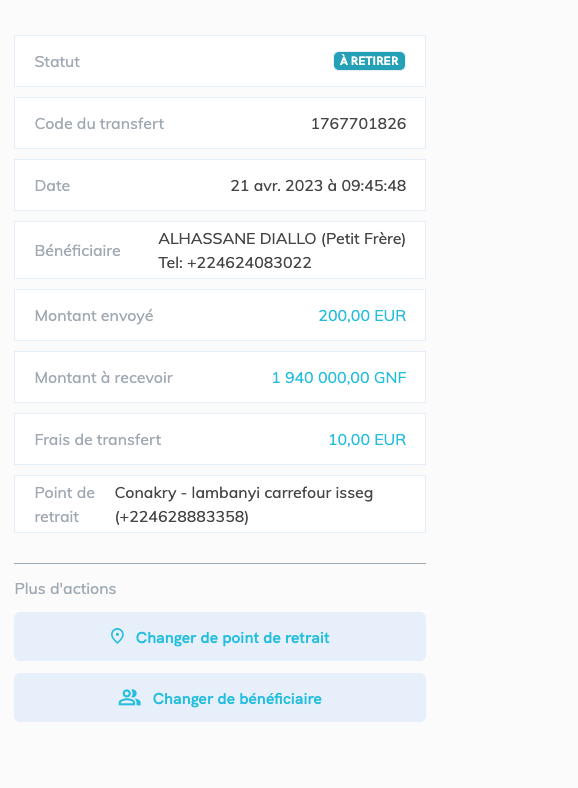
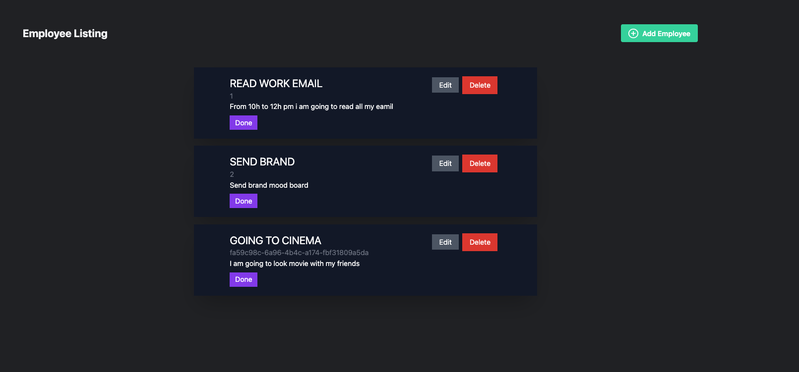
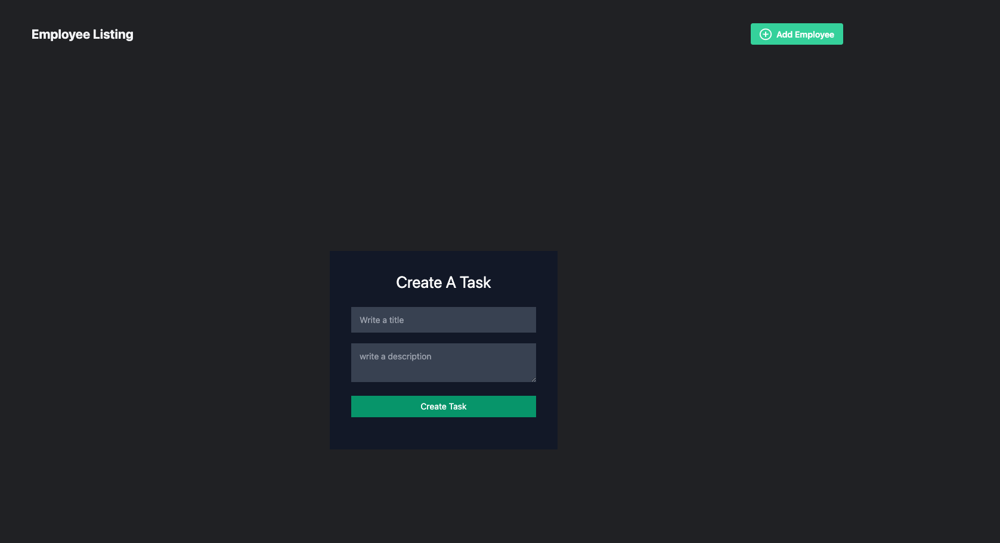

# ToDo app in ReactJS with Hooks & Context API

Todo app with react context

# As we have Three main functions on our todo app

1. List of ToDo
2. Add ToDo
3. Manage (Mark as Done and Delete Completed)

🚀 Here we saw the following things:

1. React (hooks, context)
2. Starting React app with create-react-app
3. Using Hooks to maintain state with useState
4. Using Context API to share data among components
5. Consuming Context data with useContext hook

# `screenShot`

Made with ♥ by DIALLO MAMADOU SAMBA 👋🏻
